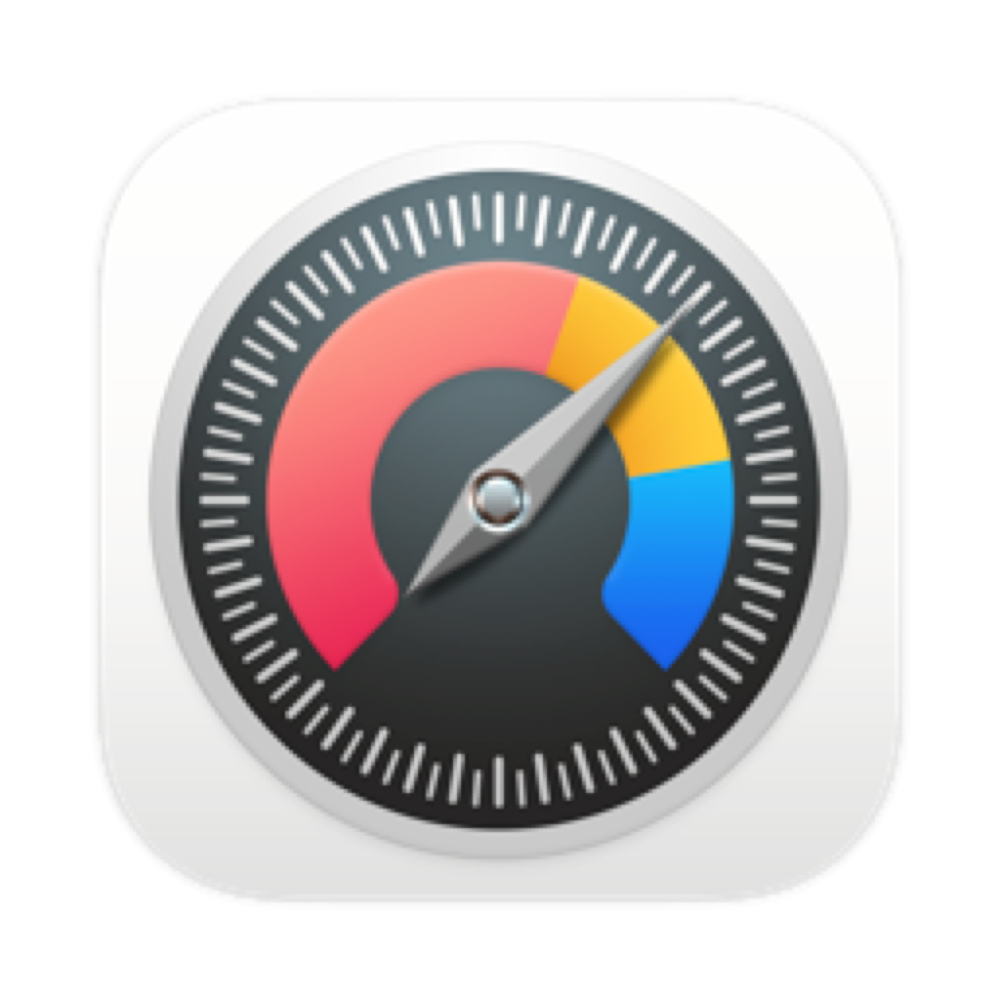

# Food Journal App

[](https://github.com/winnerbot2000/foodapptest/actions/workflows/ios.yml)

Food Journal App is a SwiftUI iOS app for tracking meals, drinks, products, restaurants, and repeat visits in one personal food log. It keeps data on-device, seeds first-run sample data, and includes lightweight analytics to help you spot favorites, hidden gems, and places worth revisiting.



## Highlights

- Track dishes, drinks, and grocery products in a single journal
- Save restaurant brands, branches, and visit history
- Rate entries with structured scoring for taste, quality, value, and more
- Attach photos stored locally on the device
- Suggest entry date and location from photo metadata
- Optionally attach current device location when logging an entry
- Scan menu photos with on-device Vision OCR, review the parsed items, and save multiple entries from the same visit
- Browse insights for top dishes, category averages, wish list items, and hidden gems
- Start with sample data so the app feels populated on first launch

## Tech Stack

- Swift 5
- SwiftUI
- Combine
- Vision for on-device menu OCR
- Core Location for optional location capture
- JSON-backed local persistence
- XCTest for unit testing
- GitHub Actions for CI

## Requirements

- macOS with Xcode 16 or newer
- iOS 16.0 or newer simulator or device

## Getting Started

1. Clone the repository.
2. Open `FoodJournalApp.xcodeproj` in Xcode.
3. Select the `FoodJournalApp` scheme.
4. Choose an iPhone simulator running iOS 16.0 or newer.
5. Build and run the app.

## Running Tests

Use Xcode's test action or run:

```sh
destination_id="$(python3 - <<'PY'
import json
import subprocess

devices = json.loads(
    subprocess.check_output(
        ["xcrun", "simctl", "list", "devices", "available", "--json"],
        text=True,
    )
)["devices"]

candidates = []
for runtime, runtime_devices in devices.items():
    if "iOS" not in runtime:
        continue
    try:
        version = tuple(int(part) for part in runtime.rsplit("iOS-", 1)[1].split("-"))
    except (IndexError, ValueError):
        version = (0,)
    for device in runtime_devices:
        name = device.get("name", "")
        udid = device.get("udid")
        if device.get("isAvailable") and udid and name.startswith("iPhone"):
            candidates.append((version, name, udid))

_, _, destination_id = max(candidates)
print(destination_id)
PY
)"

xcodebuild clean test \
  -project FoodJournalApp.xcodeproj \
  -scheme FoodJournalApp \
  -sdk iphonesimulator \
  -destination "platform=iOS Simulator,id=${destination_id}" \
  CODE_SIGN_IDENTITY="" \
  CODE_SIGNING_REQUIRED=NO \
  CODE_SIGNING_ALLOWED=NO
```

## Privacy Notes

- Journal data is persisted locally through JSON files.
- Photo attachments are stored locally on the device.
- Menu scanning uses Apple's Vision framework on-device.
- Current location is optional and only used when the user explicitly requests it.

The current `Info.plist` includes usage descriptions for photo library and when-in-use location access.

## Project Structure

```text
App/            App entry point
Views/          SwiftUI screens and flows
Components/     Reusable UI pieces
ViewModels/     View state and orchestration
Models/         App data models
Services/       OCR, analytics, location, sample data, and storage helpers
Storage/        Persistence layer
Resources/      Assets and bundled resources
Tests/          XCTest coverage
.github/        CI workflow and collaboration templates
```

## GitHub Workflow

The repository includes a GitHub Actions workflow at `.github/workflows/ios.yml` that builds and tests the shared Xcode scheme on `main` pushes and pull requests, selecting an available iPhone simulator dynamically on the runner.

## Contributing

Contributions are welcome. Start with [CONTRIBUTING.md](CONTRIBUTING.md), use the issue templates for bugs and feature requests, and follow the pull request checklist in [`.github/pull_request_template.md`](.github/pull_request_template.md).

## Support

See [SUPPORT.md](SUPPORT.md) for how to ask questions, report bugs, and handle security issues responsibly.

## License

This repository does not include a license file yet. Add one before accepting outside redistribution or open source reuse.
